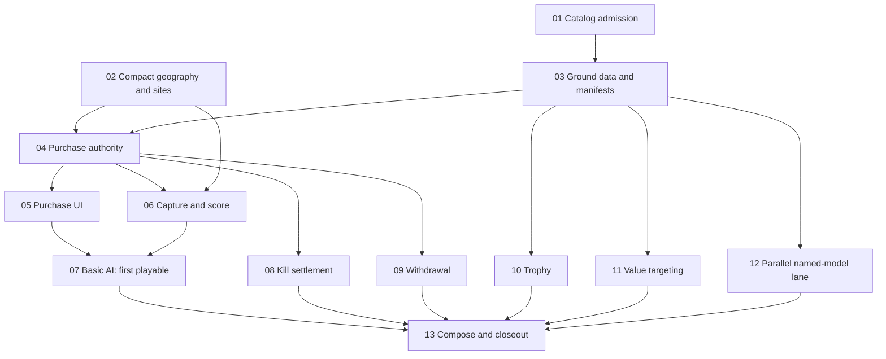

# Unit roster and skirmish implementation spec

## Next Agent Prompt

Status: implementation active under the existing harness goal, 2026-10-06.
Slice 01 catalog admission is the coordinator pickup; slice 02 compact-map
feasibility is running independently. No model production has started. Exploration is complete in [the map](unknowns.md).
The user requests **`/goal /implement-spec` once this spec is ready**, no backward
compatibility and no adversarial review.

Continue the active implementation goal with [01 catalog admission](slices/01-catalog-admission.md)
and the independent [02 geography feasibility](slices/02-skirmish-geography.md).
Read the repository and owner READMEs, this spec, starter balance and model contract.
Follow implement-spec through committed passes; a green slice is a checkpoint,
not a stopping point. Update this prompt, TODOs and the choices ledger before
ending each pass. Do not ask for individual numerical-stat approval.

Warnings: planned records cannot enter live physics/asset admission; zero-unit
preparation currently assumes a blue starting unit for camera framing; compact
layout extents need measured admission; kill source and swept APS interception
need explicit proof. Unsupported capabilities remain visibly disabled. The AI is
basic only; sophisticated AI belongs in another spec. Preserve existing authored
developer scenarios as legitimate scenario mode, not compatibility scaffolding.

Work at the dependency wavefront: freeze catalog/physical contracts before consumer
or model workers depend on them; use exclusive file assignments. Model families
begin as their own manifests freeze, with a continuously refilled worker pool.
Numeric tuning, internal clean decomposition and reversible cosmetic choices are
delegated; selected mechanics/visibility/non-goals are binding.

Global implementation TODOs:

- [ ] [01 — Canonical identities and planned availability](slices/01-catalog-admission.md)
- [ ] [02 — Compact admitted maps with reserved objective sites](slices/02-skirmish-geography.md)
- [ ] [03 — Admitted ground profiles and frozen family manifests](slices/03-ground-content.md)
- [ ] [04 — Zero-unit preparation, credits, reservations and physical entry](slices/04-purchase-authority.md)
- [ ] [05 — Faction picker, disabled variants, ghost and persistent army bar](slices/05-purchase-interface.md)
- [ ] [06 — Capture, proportional score and victory](slices/06-objective-referee.md)
- [ ] [07 — First playable human versus basic AI checkpoint](slices/07-basic-ai.md)
- [ ] [08 — Lethal provenance, credits and net team bounty](slices/08-kill-settlement.md)
- [ ] [09 — Cancellable physical return and condition-based retirement](slices/09-withdrawal-refund.md)
- [ ] [10 — Swept interception, finite service and weapon-row presentation](slices/10-trophy-protection.md)
- [ ] [11 — Threat-first automatic selection with intentional price priority](slices/11-value-targeting.md)
- [ ] [12 — Parallel family models, variants and runtime appearance admission](slices/12-named-models.md)
- [ ] [13 — Complete first-phase skirmish and close the spec](slices/13-integration-closeout.md)

## Slice graph and review checkpoints

The first playable checkpoint is slice 07: choose a faction, buy from zero, enter
physically, fight basic AI and win by score or flags, with all roster cards present.
That checkpoint is unfinished until the remaining mechanics and named models ship.
The model lane starts after individual manifests freeze; its number does not mean
wait until slice 11 to dispatch workers. Integrate Trophy families after slice 10.

The drafting synthesis combines the fewest-slice draft's early playable checkpoint,
the risk-first draft's explicit capability/map/provenance/interception verdicts,
and the seam draft's single-authority observation and availability boundaries.
Separate risky probes are named inside their owning slices so unrelated variables
cannot be accepted by one green check. No additional scope was adopted from drafts.

## Single owners and hard cutover

- Catalog owns identities, memberships, categories, availability and one purchase/
  target-priority cost. Planned metadata and admitted physical types are two states
  of that owner, not separate catalogs. Fixture inheritance supplies shared data.
- Simulation owns match phase, credits/reservations, physical lifecycle, objective
  referee, economic death settlement, Trophy and targeting. Battle composes focused
  owners rather than accumulating all policies inline. Renderer/AI/UI observe rules.
- Mapgen owns seeded objective geography and final generation; preparation admits
  it once. Standard map sizes remain intact; skirmish profile is explicit identity.
- Commands/replay, observation/publication/WASM decoding and digest form one end-to-end
  contract. Retain no browser wallet, hidden-state target priority or duplicate score.
- Scene-assets owns physical fit, rigs, mounts, source/bake/loading and model-derived
  icons. Worker manifests freeze these inputs; workers do not redefine physics.
- Existing player menu, battle lab, map/model workbenches and shared panels are review
  surfaces. Do not create a second standalone asset app or developer dashboard.
- Hard-cut authored/runtime schemas and consumers together. No backward compatibility,
  migration readers or speculative shims. Existing incompatible replay identities
  refuse through ordinary admission. Delete temporary admitted-ground placeholders
  when their families integrate; future disabled placeholders remain intentional.

## Verification and review policy

Invoke [write-tests](../../.agents/skills/write-tests/SKILL.md) before behavioral work:
one red/green tracer at a time at the narrowest useful seam. Prove deterministic
contracts with replay/native–WASM digest evidence. Pure docs and unconsumed planning
data need no battle. A changed rule gets a quick affected sample; full root `check`,
browser `verify` and the first-phase balance report run **once at implementation
closeout**, as repository policy requires. Never loosen admission/assertions to pass.

Every visual slice uses [game-ui](../../.agents/skills/game-ui/SKILL.md), renderer where
applicable, before/after plus reference [compare-screenshots](../../.agents/skills/compare-screenshots/SKILL.md),
and [preview-shots](../../.agents/skills/preview-shots/SKILL.md). An **unprimed
[screenshot-critique](../../.agents/skills/screenshot-critique/SKILL.md) is the last
visual check before acceptance**. Judge each slice's declared crop/variable; full
composition waits for integration. Review opportunities are non-blocking for
reversible work while other ready slices proceed; silence never authorizes a new
mechanic. Keep scratch evidence in ignored throwaway, not the spec/source tree.

Local shape/diff/docs review and a choices ledger are required per committed pass.
The user excluded adversarial review: do not run independent adversarial code/spec
reviews or CLI second-agent review. Unprimed visual critique remains required by
repository visual policy. No deployment, PR or external messaging is requested.

## Completion and firewalls

Complete means all TODOs are closed, every admitted ground variant has correct
named art and tested supported weapons, all 150 memberships are visible with
unsupported ones unpurchasable, and the human/basic-AI skirmish supports the selected
purchase/objective/bounty/refund/logistics/Trophy/targeting contracts end to end.
Each OPEN research item has an owning early slice or an explicit later-capability
boundary. Balance values are first-playtest tuning, not certified competitive balance.

No sophisticated AI, multiplayer/team rewards, air/drone/artillery/EW rules,
passenger transport, unproved authentic top-attack approximation, extra currency,
upkeep, income taper, objective credit income or hard match cutoff is added here.
Models of unsupported future units may remain placeholders. At actual shipping
closeout, use close-spec and replace this temporary planning inventory with links
to the authoritative catalog/assets, retaining rationale and choices.

This is a planning roster, not a list of implemented or deployable units. Modern
in-service equipment forms the core, with plausible near-future prototypes and a
small allowance for iconic recently retired equipment.

Reference: [the user-supplied Broken Arrow unit-picker screenshot](assets/broken-arrow-unit-picker.png),
originally attached as “Screenshot 2026-10-05 at 11.04.26 PM.png”. It supplies the
REC / INF / VEH / SUP / HEL / AIR category pattern, selectable unit cards and
adjacent transport choices for the later UI planning session.

This spec owns the proposed roster until implementation. As units ship, their
catalog entries own their identity, equipment, balance and model bindings. At
closeout, replace this inventory with links to the implemented catalog and retain
only the roster's rationale; do not maintain a parallel design inventory.

Iconic modern-era units are a roster requirement, even when their battlefield
role overlaps another entry. Prefer a contemporary variant of an older platform;
recognizability alone does not admit equipment too old for the setting.

Each unit family is one picker card. Each listed variant is a unique tracked unit for
balance and model identity. The player chooses a variant within the card before
deployment. Infantry and drone variants are proposed game loadouts.

Keep platform designations and recognizable names, such as M1 Abrams, M109
Paladin and F-35 Lightning II. Keep variant labels concise: the standard fit uses
its plain name, while an enhanced fit names the added equipment (SEP v2 versus
SEP v2 Trophy). Do not list absent equipment in the standard variant label.
Use concrete variant designations where known; keep role descriptions separate
from variant names. Generic infantry and drone placeholders use role or equipment
labels rather than invented official designations.

Each faction has exactly 50 tracked roster entries, counting variants. A shared
platform counts toward each faction that can deploy it.

Each category admits at most ten parent-level unit families; variants do not count
against that limit. Recovery and breaching vehicles, dedicated bombers and
fixed-wing transports are outside the roster. Multirole fighters can fill bombing
roles; helicopter transports remain included. These scope limits take precedence
over iconic-unit inclusion.

Fixed-wing gunships are also out of scope: their unique mechanics and balance
requirements are deferred.

**†** marks a prototype or near-future inclusion. Drones, helicopters and aircraft
are placeholders; their mechanics will be defined later. Scout drones belong in
REC. Kamikaze drones belong in SUP, provide precision indirect attack and destroy
themselves on impact; guidance and targeting mechanics remain undecided.

Infantry cards describe battlefield roles, not nationalities. Keep a variant
only when it changes equipment or battlefield use meaningfully. Factions may
share platforms: European purchases of U.S. equipment belong in its roster
without inventing another unit identity. Shared platform variants can reuse
their balance and model identity; faction membership is separate.

## Skirmish contracts and starter rules

These are captured requirements and the scope of the first implementation phase.
Selected rules are labeled below. Numerical tuning is delegated; capability and
physical-reference research belongs to the named early slices. [Choices](choices.md)
records delegated implementation decisions and their proof as work proceeds.

[Economy research](economy-research.md) compares Dota's reward structure with the
selected first-playtest bounty baseline. The [unknowns map](unknowns.md) records the
current quadrant walk and its open decisions. [Starter balance](starter-balance.md)
assigns prices and gameplay profiles to all 150 memberships; [model production](model-production.md)
sets the parallel authoring contract. All are planning documents, not runtime data.

### First implementation phase and unavailable units

- Start with reconnaissance, infantry and vehicles, plus support units whose
  purpose is resupply: M977 HEMTT, MAN HX and Ural-4320.
- All 150 faction roster entries remain represented in the system and menus.
- Unimplemented units have visible placeholder cards, but are disabled and cannot
  be selected, purchased or deployed. Do not hide their categories or cards.
- Enable a concrete variant only when its required mechanics are implemented.
  Drones, helicopters, aircraft and other support roles remain disabled until
  their later implementation phases. This also applies to drones in REC.
- Dependency decisions for mechanics such as infantry carriage and active
  protection are resolved by slices 01/03/10; a named roster entry is not proof
  that its mechanics exist. Missing excluded behavior keeps a variant disabled.

### Starter stats, prices and model production

The user explicitly delegates starter numerical tuning to the planning agent:
choose and document stats and prices without requesting confirmation for each
value. This includes all 150 entries and numerical parameters of agreed mechanics.
Label these values as first-playtest baselines, with their rationale and tuning
risks. Delegation does not authorize implementation or silently adding mechanics;
substantive behavior and scope tradeoffs still belong in the unknowns walk.

- Define starter stats and credit prices for **all 150 tracked roster entries**,
  including disabled entries. Values for unimplemented capabilities are explicit
  provisional design data until their mechanics can be admitted and tested.
- Reuse existing tested ground movement, weapons, damage, sensing and resupply
  mechanics. Do not invent new combat mechanics merely to distinguish variants.
- Starter balance must support the intended opening purchases and economy. Tune
  prices alongside health, armor, mobility, sensors, weapons and carried ammo;
  different faction memberships do not create duplicate tuning owners for a
  shared platform variant.
- Individual unit models are a major implementation deliverable. Each tracked
  variant needs its own model identity/binding with the correct platform silhouette
  and visible equipment. Shared geometry and reusable parts are allowed, but a
  generic tank or vehicle model is not the finished named-platform model.
- **Require independent subagents for model production.** Run many model tasks in
  parallel, using the concurrency the harness supports. Give each agent a bounded
  platform/family assignment and its variants, frozen physical/mount contracts,
  reference inputs and exclusive asset paths. Refill the worker pool as tasks
  finish rather than serializing all modeling through one agent.
- The coordinating agent integrates and checks model/mount fit, variants, icons,
  asset budgets and appearance bindings. Models are judged in the actual renderer
  using the repository's visual review workflow. Share installed dependencies;
  keep agent scratch output and build output isolated as the repository requires.
- Unimplemented units may keep placeholder cards/models while their production
  work is pending; they remain disabled until their required behavior is ready.
- **User-selected price/targeting contract:** retain one unit `cost` for purchase
  price and automatic value priority; changing price is intended to change
  targeting. Among targets the firing weapon can affect, prioritize enemies
  capable of returning fire and damaging the shooter, then descending cost,
  distance and stable observed identity. Non-threatening targets remain available
  when no threatening target is shootable.
- Threat assessment uses observed enemy type/equipment, range and position,
  never hidden ammunition or orders. A weapon in an ordinary reload remains a
  threat; enemy ammunition is assumed available unless the observation contract
  explicitly admits that knowledge. Preserve existing minimum-range, line-of-fire
  and damage admission; price priority does not authorize an impossible shot.

### Trophy active protection

- **User-required panel presentation:** show **Trophy** as a weapon entry in
  the unit info panel, alongside the unit's other weapons. Reuse the existing
  weapon-row presentation rather than introducing a separate protection panel.
- Show remaining charges using the weapon ammunition/amount treatment (initially
  four) and the three-second interception cooldown using the weapon timer
  treatment. Empty charges and an active cooldown must read distinctly.
- Trophy remains automatic defensive protection; presenting it as a weapon
  does not give it an offensive target/fire command. Its charge count and timer
  are observed simulation state, subject to the same side-visibility rules as
  other weapon information. No duplicate Trophy counter elsewhere is required.
- **Selected starter count: four Trophy charges per equipped variant.** This
  is gameplay tuning, not a claim about real-world capacity. All Trophy-equipped
  variants start with the same count; existing armor, weapon and sensor stats
  can distinguish tiers.
- When a missile is about to hit that unit and charges remain, consume one charge
  and detonate the missile prematurely.
- **Chosen threat eligibility (A):** intercept anti-tank missiles and
  rocket-propelled anti-armor rounds, including top-attack missiles. Javelin,
  TOW, Kornet and RPG-7/RPG-29 are examples; apply the rule through projectile
  properties rather than weapon-name exceptions. Bullets, tank-gun shells and
  artillery shells bypass Trophy. Drone interactions remain deferred with drone
  mechanics.
- **Selected interception cooldown: three seconds per protected unit.** After
  an interception, Trophy cannot intercept again during that interval, even when
  charges remain. Multiple attackers can overwhelm protection by landing threats
  during that window.
- Consume a charge only when an interception occurs. A threat arriving while
  protection is cooling down proceeds through ordinary hit/damage resolution;
  it does not consume another charge merely because it arrives.
- An exhausted system cannot intercept another eligible threat. The charge count
  is authored unit data so future balance tuning can change counts independently.
- **User-selected replenishment (A):** supply trucks gradually replenish charges
  from finite stock up to the authored capacity (currently four). Refilling never
  resets the interception cooldown. Agent-selected starter tuning: **ten seconds
  and 20 supply stock per restored charge**. Use existing stationary recipient
  and deployed-truck service conditions; intercepted incoming fire does not by
  itself count as the recipient firing a weapon.
- **Agent answers under delegated preferences and stats:** start with an 8 m
  interception standoff from the threatened hull surface, all-around coverage
  including top attack. Intercept only an eligible projectile physically on an
  imminent collision path with the hull; projectiles merely passing nearby do
  not spend charges. Use swept flight events so fast projectiles cannot skip the
  interception boundary between ticks. Resolve ties by flight-event time and
  stable projectile identity; only one intercept succeeds before cooldown starts.
- Detonate at the interception point using the incoming weapon's ordinary blast
  and suppression rules; nearby infantry/props can still be affected. Do not also
  apply the prevented direct hull hit, or add a second damage system for Trophy.
  Recheck guidance/path changes before interception rather than trusting a stale
  target designation. These are initial behavior choices to verify in physical
  flight/impact tests. This is the newly requested combat mechanic, not a
  reason to redesign the existing ground-combat foundation.

### Match scope

- **Chosen first skirmish mode: 1v1 (A).** Each side has one player, an independent
  credit wallet, a bounty pool and a 30-living-unit limit. Objective ownership
  and score belong to the side; ordinary kill credits and bounty payouts go to
  the opposing player credited with the kill.
- Multiple players per team, shared reward allocation and coordinated opening
  phases are deferred. Keep player and side identities distinct for later team
  play without implementing its economy now.
- **Chosen opponent mode: human versus AI first (A).** The AI chooses a faction
  and uses the same credit, purchase/deployment, unit-cap, capture, scoring and
  bounty rules. Online human-versus-human multiplayer is deferred.
- **Answered by the agent on the user's behalf:** the AI acts on its own side's
  visibility and may only purchase enabled variants. This follows the existing
  side-knowledge contract and the user's equal-rules requirement; no hidden-state
  access, extra income or disabled-unit purchases are part of this mode.
- **User-selected AI scope: basic only.** Add a deterministic controller that
  buys a legal opening template, sends ground combat units toward public objectives,
  purchases reinforcements from enabled roles as credits/slots permit, and uses
  existing fire, movement and tactical reactions. Give it a supply truck and a
  simple deployed service position behind its own force. No elaborate flank
  planning, learning, difficulty economy cheats or strategic optimization is
  required. Sophisticated AI belongs in a separate spec.
- Re-evaluate economy/objective orders every five seconds. Prefer the nearest
  non-owned objective by known route, then stable objective ID; distribute new
  groups among objectives rather than sending every group to one flag. Once
  every objective is owned, retain defensive positions. Reinforcement role order
  starts rifle, recon, anti-armor, armed vehicle, replacing the opening supply
  truck when lost. Skip unavailable roles and avoid spending beyond the wallet
  or unit cap. These are agent-selected baseline choices, not a claim of strong AI.
- AI orders use the normal command path and are recorded for replay. Playbacks
  replay accepted commands rather than rerunning the AI. Save/resume AI memory is
  not added here. Existing tactical AI is not proof that new purchasing/objective
  behavior exists; build and verify this small controller explicitly.

### Faction selection

- Starting a skirmish requires choosing one faction: U.S., European, or Eastern
  (Russia + China).
- The chosen faction determines the units available to purchase during the match.
- Every match starts with **zero owned units**. The player receives starting
  credits and purchases and deploys their opening force one unit at a time.
- Any implemented unit in that faction's roster is available to choose. Select
  the concrete variant within its family before deploying it. Unimplemented
  entries remain visible as disabled cards.

### Opening preparation

- **Chosen preparation phase (A):** both players choose opening purchases and
  destinations before combat starts. Units enter through their normal road-edge
  spawns when combat starts; preparation does not pre-position them at destinations.
- No passive income, capture progress or objective score accrues in preparation.
- **Agent-selected preparation flow:** a 60-second preparation window, with a
  Ready button to start early once both sides are ready. The AI plans during this
  phase and can signal ready; the human may start with no purchases. At timeout,
  begin with confirmed purchases. No purchases are generated for the human.
  Cancelling pending purchases restores their reserved credits and slots.

### Objective scoring — selected starting rule

- **Chosen scoring model (A): both sides score proportionally** to their owned,
  uncontested objectives. Every objective has the same rate within a match;
  contested areas score for neither side. There is no majority-only threshold
  or reduced minority rate.
- Selected initial target T = 1,000. For N objectives, the smallest majority is
  M = floor(N / 2) + 1. Set each objective's rate to T / (1,800 × M) points per
  second. Holding M scoring objectives continuously from zero takes 30 minutes.
- For three, five or seven objectives, per-objective rates are respectively
  0.27778, 0.18519 or 0.13889 points per second. A five-objective example: three
  flags produce 33.33 points/minute; two produce 22.22. Both sides make progress,
  but sustained majority control reaches the target first.
- Travel, capture time, contests and ownership changes can extend elapsed match
  time beyond that baseline. Additional flags accelerate scoring unless owning
  every flag triggers the immediate-win rule first.
- These rates implement the selected starter calibration, not tested balance. Accumulation,
  rounding and simultaneous victory evaluation must be deterministic.

### Credits and purchasing

- **Credits are the only spendable currency**, following the single-currency
  model of WARNO and Broken Arrow. Objective score is a separate victory tally.
- **Selected passive income: 200 credits per minute**, accrued continuously
  after preparation. **Starting credits equal five minutes of passive income:**
  currently **1,000 credits**. Derive the opening budget from the configured
  income rate rather than maintaining a separate unrelated amount.
- Tune starter unit prices so this budget purchases roughly five to ten mixed
  or lighter units, or a smaller tank-heavy force with a couple of tanks.
  Individual variant prices still need defining.
- Credits accrue continuously during the match. Passive income does
  not taper with army size, success or bounty; doing well must not reduce income.
- Destroying enemy units also earns credits under the selected first-playtest
  bounty formula below.
- The player spends credits to buy units.
- With enough credits, the player can purchase additional units during play and
  add them to their force.
- All of the player's units appear on the bottom bar. Purchasing and deploying
  additional units follows the Broken Arrow interaction pattern.

### Contest points and victory

- Every map has **three to seven contest points**, with the count depending on
  map size. These are capturable areas/flags intended to encourage battle.
- Capturing and holding an area slowly accumulates objective score for its team;
  longer control earns more score. **Chosen reward: objective score only (A).**
  Holding objectives grants no additional credits, keeping territory control
  from also increasing the leading team's purchasing power.
- Capture-area positions are randomly generated as part of the map layout.
  Exactly **one or three area centers lie on the center line halfway between
  the two team sides**, creating shared central contest points. The remaining
  areas are placed off that line. This interprets “under the center line” as
  centered on the halfway line; the total remains three to seven.
- **User-required objective sites:** reserve dedicated objective areas and
  surrounding buildings as part of town generation. Town objectives are recognizable
  town squares or meaningful road intersections, not arbitrary coordinates inside
  a settlement. The user explicitly accepts existing central X intersections as
  objective sites; do not replace a useful junction merely to create a square.
  Rural objectives
  are open fields or open areas framed by a few farmhouses, never forest interiors.
  Hills are a future site type when terrain supports them. Roads, buildings and
  approaches should be composed around each site's use as a contest area.
- **Pacing admission work:** existing map sizes span 4–10 km, which makes
  edge-to-center infantry travel roughly 11–27 minutes at 11 km/h. Before locking
  the playable skirmish sizes, run a narrow layout/travel probe for a compact
  skirmish generation profile. Agent-selected candidate extents are 1.2/1.8/2.4/3 km
  for small/medium/large/XL. Keep existing saved maps and standard 4/6/8/10 km
  generation unchanged; admit a named skirmish profile through the existing map
  generation owner, not browser rescaling or a second map generator. Candidate
  sizes remain OPEN to measured layout admission; tune their numbers under the
  user's delegation, preserving flags, terrain character and connected edge roads.
- **Agent-selected size mapping:** small/medium/large/XL maps use **3/5/7/7**
  objectives, with **1/1/3/3** centers on the halfway line. Off-center sites form
  matched opportunities with independent coordinates, not mirrored positions.
- Start with a 15% tolerance on counterpart approach travel time for representative
  foot, tracked and wheeled movers; match road/highway/no-road class and town-square,
  farmhouse or field makeup. Keep site centers at least 150 m apart and 150 m from
  entry points. These are delegated numerical baselines, subject to map admission.
  Reserve center-line sites before town/forest infill so dedicated squares or fields
  remain possible. Validate final geometry and reachability; use bounded generation
  attempts with an explicit refusal rather than moving a required center-line flag
  off the line, reducing the count or accepting a forest site to make generation pass.
- **Chosen off-center placement: independent positions with comparable access
  (B), rather than mirrored coordinates.** Match opposing opportunities by
  approximate travel/accessibility, road or highway access (including no road),
  and local makeup. A small-town objective should have a comparable small-town
  counterpart; a farmhouse objective should have a farmhouse counterpart.
- Favor organic, terrain-driven placement over a grid. Equal coordinates or
  geometric symmetry are not required; comparable access and local composition
  matter more.
- Generated placement uses the map seed and a dedicated random stream so the
  same map identity retains the same objectives. The selected count mapping uses
  odd totals. Fairness is measured from final geometry, not coordinate symmetry.
- **Updated victory target: approximately 1,000 objective points.** Reaching
  the target wins; capturing every flag remains the special immediate-win case.
  The new pacing requirement supersedes the fixed 30-minute cutoff: roughly
  30 minutes of continuous majority control should reach the target, while
  contested objectives and changing ownership can extend the match. There is
  no accepted hard time limit under this updated requirement.
- A team that captures **every flag ends the match and wins immediately**,
  regardless of the accumulated score. Capture completion, rather than simply
  entering the final area, must be defined by the capture rules.
- **Chosen capture behavior: timed, uncontested capture (option A).** Ground
  combat units must remain in the area for a short capture period. Enemy presence
  contests the area and pauses both capture progress and objective scoring, giving
  defenders time to react before an all-flags victory.
- **Chosen unattended scoring: ownership persists and empty areas keep scoring
  (A).** Friendly units may leave after capture. Enemy ground combat units
  entering pause scoring and begin the timed takeover, encouraging maneuver
  rather than requiring a permanent garrison at every objective.
- **Answered by the agent on the user's behalf under delegated preferences:**
  all objectives begin neutral, requiring both teams to advance and capture.
- **Answered by the agent on the user's behalf:** every objective earns score at
  the same rate, keeping the rules simple; use the selected majority-calibrated
  rate above.
- **Answered by the agent on the user's behalf:** contesting pauses and preserves
  capture progress, allowing defenders to interrupt without instantly erasing
  the attacker's progress. Uncontested departure, neutralization and a change
  of capturing team still need defined progress behavior.
- The earlier delegated timeout/draw rule is superseded by the new score-target
  victory condition. Simultaneous target crossings still need a deterministic
  outcome rule.
- **Starter tuning chosen by the agent under numerical delegation:** capture
  radius **50 m**, uncontested capture duration **20 seconds**. These give ground
  units a readable area and defenders a response window; they are untested values
  to validate against map scale, movement speed and firing ranges. Takeover and
  progress-transition rules follow below.
- **Agent answers under delegated preferences:** living ground combat units in
  REC/INF/VEH can capture or contest, including empty-ammo and suppressed units.
  Logistics, drones, aircraft and helicopters do not. A squad qualifies when a
  living member is in the area; a vehicle when its hull center is in the area.
  Extra units do not accelerate capture. A garrisoned soldier uses its physical
  position for area membership.
- Capture a neutral or enemy-owned area in one 20-second uncontested hold; there
  is no additional neutralization phase. A contest pauses and preserves progress;
  leaving with no eligible capturing unit resets that side's incomplete progress.
  Enemy entry pauses the former owner's scoring while capture proceeds. Ownership
  changes only on completion. A returning defender interrupts but does not erase
  progress while attackers remain; a new capturing side starts its own progress.
- All-flags victory requires ownership of every area with none contested, evaluated
  on capture completion. Score victory uses the first authoritative crossing of
  1,000; an exactly simultaneous crossing is a draw. No renderer-owned timer or
  unit-elimination victory rule is added. Players with zero units can repurchase.
- Objective score is a victory tally, not a spendable currency. Credits fund
  unit purchases separately.

### Per-player unit limit

- Each player may own at most **30 living units** at a time. This is a concurrent
  force limit, not a lifetime purchase limit or a faction catalog limit.
- A squad is one unit, as is a vehicle or a resupply truck. Individual soldiers
  within a squad do not each consume a slot.
- A destroyed unit releases its slot. A deployment cannot exceed the limit.
- The bottom bar represents every owned unit; 30 bounds both the force and the
  number of cards. Scrolling may be added if needed.
- **Answered by the agent on the user's behalf:** confirmed purchases reserve
  slots immediately, including preparation purchases and units awaiting entry.
  Count reservations plus living units against 30; arrival converts a reservation
  into a living-unit slot rather than consuming a second slot. Enforce purchase
  affordability and the cap atomically so concurrent orders cannot bypass them.
- How transported units count remains to be specified.

### Deployment and entry

- Purchasing a concrete unit variant enters placement mode.
- A ghost preview of that unit follows the cursor across the battlefield.
- **Answered by the agent on the user's behalf:** previewing does not spend
  credits or reserve a slot; cancelling the preview is free. Confirming placement
  checks affordability and availability, deducts the price and reserves a slot.
  A rejected confirmation spends nothing and creates no reservation. These rules
  keep reversible previews simple and prevent queued purchases bypassing the cap.
- **Left-click** confirms deployment at the cursor's map location. The player
  chooses this deployment destination anywhere on the map.
- This flow is used for both the opening force and later reinforcements. Starting
  credits fund purchases; the match does not provide a pre-spawned starter army.
- Purchased units enter through specific spawn zones; the selected destination
  is distinct from their physical entry point.
- The bottom team's spawn zone is always on the bottom side of the map.
- The top team's spawn zone is always on the top side of the map.
- Each team's entry point is where the main road meets its side of the map.
- A newly deployed unit is added to the player's force and bottom bar.

### Refund and return to base

- Provide a **Refund** button for an owned unit. It orders that unit to return
  to base rather than immediately removing it from the battlefield.
- Refund value depends on time spent on the field, remaining health and remaining
  ammunition, using the unit's original purchase cost as the basis.
- **Selected refund range: 15–75% of original purchase cost.** The user selected
  a 75% ceiling for a fresh, healthy, fully supplied returning unit. Even a unit
  at 1 HP with no ammunition can return at least 15%. Use the selected formula
  below; balance remains untested.
- **Answered by the agent on the user's behalf:** pay credits and release the
  slot only on arrival at base. The withdrawing unit remains vulnerable and
  occupies its slot; destruction before arrival prevents a refund. This preserves
  the physical return-to-base action and deployment commitment.
- **Answered by the agent on the user's behalf:** refunding does not reduce the
  team bounty pool. Returning veterans must not bypass the selected team-level
  comeback mechanic.
- **Accepted first-playtest formula:** refund fraction = 0.15 + 0.60 ×
  ((H + A) / 2) × max(0.5, 1 − t / 1,200), where H and A are remaining health
  and ammunition fractions between zero and one, and t is seconds on the field.
  Time gradually halves the above-floor component over ten minutes and then
  stops reducing it. Full condition yields 75% initially and 45% after ten
  minutes; half health/half ammo after ten minutes yields 30%. Values are bounded
  to the selected 15–75% range. This formula is selected starter tuning, not
  evidence of tested balance.
- Use the lifecycle decisions below for return/cancellation and fixed-point
  fractional carry. [Starter balance](starter-balance.md) defines squad health,
  finite-ammunition, Trophy and truck-stock accounting. Resupply may improve
  condition before retirement; age never resets.

### Routine lifecycle decisions — agent answers under delegation

- Return-to-base uses the player's road-edge entry point. Withdrawal is an ordinary
  fastest-route move; the unit retains ordinary fire-at-will/return-fire policy.
  Cancel withdrawal before base arrival with a new order; no refund has been paid.
  Refund condition and age are evaluated at actual retirement, not button press.
- A confirmed reinforcement appears immediately in the bottom bar as pending.
  Pending orders are cancellable for the full reserved price and slot before
  physical spawn; after spawn, use the return-to-base refund rule. Preserve the
  purchase price on each instance for refunds and death rewards.
- Spawn reinforcements in confirmation order, one per second when the entry
  footprint is clear, then route to their destination using the existing fastest
  route. A blocked entry waits visibly; never overlap bodies or charge twice.
- Award kill credits immediately, but do not grant enemy identity, position or a
  destruction notification beyond normal side evidence. The wallet change can
  still imply an unseen loss; accepting that limited economic information follows
  the user's immediate kill-credit economy and existing visibility contract.
- Credit a full unit destruction once. A squad pays on its last soldier's death,
  not on each casualty. The hostile source of the lethal damage owns the kill,
  even if the shooter has since died; carry source attribution through explosions
  and building collapse. Friendly fire and source-free deaths give no kill reward
  or killer-pool growth, and do not clear the victim's bounty pool. Keeping that
  pool prevents deliberate friendly-fire denial from erasing enemy shutdown value.
- For simultaneous deaths, snapshot both bounty pools before the tick's losses.
  Compute per-victim bonuses from that snapshot; if a side's bonuses exceed its
  pool, scale them proportionally to the available pool. Apply paid bonuses and
  loss deductions, floored at zero, then add growth from that tick's kills. This
  prevents iteration order from selecting a richer payout and lets balanced trades
  produce symmetric outcomes. Use deterministic fixed-point/rational arithmetic
  with fractional credit carry; do not round away passive income each tick.

### Admission and deferred capabilities

Use existing side-scoped movement placement to validate the destination and
preview; reject out-of-bounds, water or an invalid footprint before confirmation.
Enemy occupancy hidden by fog does not become a placement oracle: validate against
side knowledge, then use ordinary movement/traffic rules as the unit travels.
Units may enter hostile destinations and encounter resistance; there is no teleport.
A successful placement exits to ordinary selection; select the card again for
another purchase. Arrival facing follows the existing movement contract unless
the placement gesture supplies an explicit supported facing.

Passenger transport, authentic Javelin/Akeron top-attack, aerial movement/combat,
drones and electronic warfare are not proven by a roster name. Audit their existing
capability paths before enabling the associated variant; keep missing capabilities
visible but disabled. Artillery and non-resupply support remain outside phase one.
Transported-unit counting and air/drone entry are OPEN for their later capability
specs. Preserve a soldier squad's separate identity and price if transport ships;
loading must not erase its slot or bounty identity.

### Team bounty pool — chosen comeback mechanism

- **Chosen accounting: net combat success (option A).** Successful kills build
  an internal bounty pool on the killing team; losses and bounty payouts reduce
  its pool, with a floor of zero. This prevents long balanced exchanges from
  continually inflating both teams' bounty pools.
- Destroying any unit belonging to that team pays a share of its pool, including
  when the victim is a fresh reinforcement with no kills of its own.
- Shares are weighted by the destroyed unit's cost, capped and deducted from the
  victim team's pool when paid. Ordinary kill credits and the bounty bonus both
  use the one credits currency.
- The bounty need not be displayed to the player. It creates a comeback opening
  through successful combat without reducing the leading player's passive income.
- **Accepted first-playtest baseline:** let C be the victim's original purchase
  cost, S the equal starting credit budget and B the victim side's bounty pool
  immediately before the loss.
  - Pay ordinary kill credits of **25% C** to the player credited with the kill.
  - Add **50% C** to the killing side's bounty pool.
  - Pay an additional bonus of **min(B, 50% C, B × C / S)**.
  - Subtract that paid bonus and then **50% C** from the victim side's pool,
    stopping at zero. Losses therefore reduce bounty even if no bonus is paid.
  - Ordinary reward plus bounty bonus caps at **75% C**. The supply-truck bonus
    is separate: an additional **25% of the supply truck's original purchase cost**.
- Calculate growth from the destroyed unit's cost, never from collected rewards;
  collected bonuses do not recursively generate bounty. Passive income stays
  unchanged. The fixed starting-budget denominator prevents fresh purchases
  from diluting the bounty payout rate.
- These are selected starter rules, not proven balance. Use the lifecycle
  decisions above for attribution, simultaneous deaths and fractional carry.
  Start without an extra team-pool cap; the selected per-death payout cap still
  applies. Teammate reward sharing is deferred with team play.

Individual-unit bounties were superseded because a leader could protect veterans
and send fresh, low-bounty units instead. Army-size income taper was rejected
because it feels like a penalty for doing well. A replacement reserve is not a
selected mechanism.

### Ammunition and logistics

- Ammunition should be scarce enough for resupply trucks to matter in a sustained
  battle or long campaign.
- Starter infantry ATGM loads are **three or four missiles**, assigned per
  weapon in [starter balance](starter-balance.md). Tune with hit rate, armor and
  active protection; carried missiles do not imply guaranteed kills.
- Resupply vehicles are part of the first implementation phase and consume a
  unit slot, making logistics a choice within the 30-unit force limit.
- **Accepted first-playtest supply-truck bonus: 25% of original purchase cost**,
  on top of ordinary kill credits and any team bounty payout. Pay it once on
  destruction, independent of remaining stock. A 100-credit truck therefore
  pays 50–100 credits total under the selected bounty baseline.
- The supply bonus does not increase bounty-pool growth: growth still uses only
  50% of the destroyed unit's original purchase cost, as selected above.
- [Starter balance](starter-balance.md) defines loads, truck stock and service
  rates. Keep existing unlimited rifle/HMG reserves initially; scarce heavy
  ammunition creates logistics pressure without constant rifle micromanagement.

The earlier [capture/economy draft](../battle-foundation/slices/21-capture-economy.md)
contains provisional numbers and objective rules; this capture does not adopt
those values. The income requirements, chosen team bounty approach and open tuning
questions above are the current capture.

Tracked variants:

| Faction | REC | INF | VEH | SUP | HEL | AIR | Total |
|---|---:|---:|---:|---:|---:|---:|---:|
| U.S. | 7 | 6 | 11 | 9 | 7 | 10 | **50** |
| European | 7 | 6 | 13 | 9 | 7 | 8 | **50** |
| Eastern — Russia + China | 6 | 8 | 11 | 9 | 6 | 10 | **50** |
| Total | 20 | 20 | 35 | 27 | 20 | 28 | **150** |

Parent-level unit families (maximum ten per category):

| Faction | REC | INF | VEH | SUP | HEL | AIR |
|---|---:|---:|---:|---:|---:|---:|
| U.S. | 6 | 5 | 6 | 7 | 6 | 8 |
| European | 6 | 5 | 8 | 8 | 6 | 7 |
| Eastern — Russia + China | 6 | 6 | 10 | 8 | 6 | 7 |

## U.S. faction

### REC — Reconnaissance

- **Army Scouts:** Light patrol.
- **Force Recon:** Recon patrol.
- **Scout Snipers:** M107 heavy sniper team.
- **M3 Bradley CFV:** M3A3.
- **M1127 Stryker RV:** Reconnaissance vehicle.
- **Scout Drone**
  - Standard.
  - Thermal.

### INF — Infantry

- **Rifle Squad:** Standard infantry.
- **Marine Squad:** Close-quarters infantry.
- **Marksman Squad:** M110-equipped longer-range infantry.
- **ATGM Team**
  - FGM-148 Javelin.
  - BGM-71 TOW 2A.
- **Air-Defense Team:** FIM-92 Stinger.

### VEH — Vehicles

- **M1 Abrams**
  - SEP v2.
  - SEP v2 Trophy.
  - SEP v3 Trophy.

  All three are M1A2 configurations. Trophy-labeled variants include active
  protection. The SEP v3 Trophy fit is supported by
  [General Dynamics](https://www.gdls.com/abrams/).

- **M2 Bradley IFV:** M2A4.
- **Stryker**
  - M1126 ICV.
  - M1296 Dragoon.
  - M1134 ATGM.
- **ACV:** ACV-P.
- **LAV**
  - LAV-25A2.
  - LAV-AT.
- **M1278 JLTV:** HMG.

### SUP — Support

- **M109 Paladin:** M109A7.
- **M270 MLRS:** M270A2.
- **M142 HIMARS**
  - GMLRS.
  - PrSM.
- **M1129 Stryker Mortar:** 120 mm mortar carrier.
- **Stryker M-SHORAD:** Gun-and-missile air-defense vehicle.
- **M977 HEMTT:** General resupply.
- **Kamikaze Drone**
  - Anti-personnel.
  - Anti-armor.

### HEL — Helicopters

- **AH-64 Apache:** AH-64E Guardian.
- **UH-60 Black Hawk:** UH-60M.
- **CH-47 Chinook:** CH-47F.
- **AH-6/MH-6 Little Bird**
  - AH-6M.
  - MH-6M.
- **AH-1Z Viper:** Attack helicopter.
- **UH-1Y Venom:** Utility transport.

### AIR — Aircraft

- **F-16 Fighting Falcon:** F-16C Block 50.
- **F-15 Eagle**
  - F-15E Strike Eagle.
  - F-15EX Eagle II.
- **F-22 Raptor:** F-22A.
- **F-35 Lightning II**
  - F-35A.
  - F-35B.
- **F/A-18 Super Hornet:** F/A-18E.
- **EA-18G Growler:** Electronic-warfare aircraft.
- **A-10 Warthog:** A-10C — retained as an iconic exception if needed.
- **MQ-9 Reaper:** MQ-9A.

## European faction

Shared U.S. platforms are deliberate purchases, not additional national variants.

### REC — Reconnaissance

- **Fennek:** Reconnaissance vehicle.
- **EBRC Jaguar:** Armed reconnaissance vehicle.
- **Ajax:** Tracked reconnaissance vehicle.
- **VBL:** Machine-gun scout.
- **Recon Patrol:** Light patrol.
- **Scout Drone**
  - Standard.
  - Thermal.

### INF — Infantry

- **Rifle Squad:** Standard infantry.
- **Assault Squad:** Close-quarters infantry.
- **Marksman Squad:** Longer-range infantry.
- **ATGM Team**
  - FGM-148 Javelin.
  - Akeron MP.
- **Air-Defense Team:** FIM-92 Stinger.

### VEH — Vehicles

- **Leopard 2**
  - 2A6.
  - 2A7V.
  - 2A8.
- **Challenger**
  - Challenger 2 TES.
  - Challenger 3†.
- **Leclerc:** XLR.
- **CV90**
  - CV9040C.
  - Mk IV.
- **Puma:** Level C.
- **Boxer**
  - APC.
  - RCT30.
- **VBCI:** Infantry fighting vehicle.
- **KF51 Panther†:** Prototype main battle tank.

### SUP — Support

- **PzH 2000:** Tracked 155 mm howitzer.
- **CAESAR:** 8×8.
- **MARS II:** Multiple-launch rocket system.
- **Gepard:** 1A2.
- **Boxer Skyranger 30:** Gun-and-missile air defense.
- **NASAMS:** NASAMS 3.
- **MAN HX:** General resupply.
- **Kamikaze Drone**
  - Anti-personnel.
  - Anti-armor.

### HEL — Helicopters

- **EC665 Tiger**
  - UHT.
  - HAD.
- **NH90:** TTH.
- **AW101 Merlin:** HC4.
- **AW159 Wildcat:** AH1.
- **AH-64 Apache:** AH-64E Guardian.
- **CH-47 Chinook:** HC6.

### AIR — Aircraft

- **Eurofighter Typhoon:** Tranche 3.
- **Rafale:** C F4.
- **JAS 39 Gripen:** E.
- **Tornado**
  - IDS.
  - ECR.
- **Mirage 2000:** 2000D RMV.
- **F-16 Fighting Falcon:** F-16C Block 50.
- **F-35 Lightning II:** F-35A.

## Eastern faction

Russian and Chinese equipment remains identifiable by platform and weapon.
Generic infantry cards are shared roles; origins of their final equipment
and appearances will be retained when authored. Drone platforms are undecided.

### REC — Reconnaissance

- **Scouts:** Light patrol.
- **Sniper Team:** ASVK heavy sniper team.
- **BRM:** BRM-3K.
- **Tigr:** Tigr-M.
- **Orlan-10:** Reconnaissance drone.
- **Scout Drone:** Thermal.

### INF — Infantry

- **Rifle Squad:** Standard infantry.
- **Assault Squad:** Close-quarters infantry.
- **Marksman Squad:** SVD-equipped longer-range infantry.
- **RPG Team**
  - RPG-7.
  - RPG-29.
- **ATGM Team:** Kornet.
- **Air-Defense Team**
  - Igla-S.
  - FN-6.

### VEH — Vehicles

- **T-72:** T-72B3 (2016).
- **T-80:** T-80BVM.
- **T-90:** T-90M Proryv.
- **T-14 Armata†:** Main battle tank.
- **BMP IFV Family**
  - BMP-2M Berezhok.
  - BMP-3.
- **BTR:** BTR-82A.
- **Type 99:** ZTZ-99A.
- **Type 15:** ZTQ-15 light tank.
- **ZBL-08:** Wheeled IFV.
- **T-15 Armata†:** Heavy IFV.

### SUP — Support

- **2S19 Msta-S:** 2S19M2.
- **BM-21 Grad:** BM-21 rocket artillery.
- **9K515 Tornado-S:** Heavy rocket artillery.
- **Pantsir:** Pantsir-SM.
- **Buk:** Buk-M3 medium-range air defense.
- **PLZ-05:** Chinese tracked 155 mm howitzer.
- **Ural-4320:** General resupply.
- **Kamikaze Drone**
  - Anti-personnel.
  - Anti-armor.

### HEL — Helicopters

- **Mi-8 Hip:** Mi-8AMTSh.
- **Mi-24/Mi-35 Hind:** Mi-35M.
- **Mi-28 Havoc:** Mi-28NM.
- **Ka-52 Alligator:** Ka-52M.
- **Z-10:** Attack helicopter.
- **Z-20:** Utility transport.

### AIR — Aircraft

- **Sukhoi Flanker Family**
  - Su-27SM3.
  - Su-30SM2.
  - Su-35S.
  - Su-34.
- **MiG-29 Fulcrum:** MiG-29SMT.
- **MiG-31 Foxhound:** MiG-31BM.
- **Su-25 Frogfoot:** Su-25SM3.
- **Su-57 Felon:** Stealth multirole fighter.
- **J-10 Vigorous Dragon:** J-10C.
- **J-20 Mighty Dragon:** Stealth fighter.
